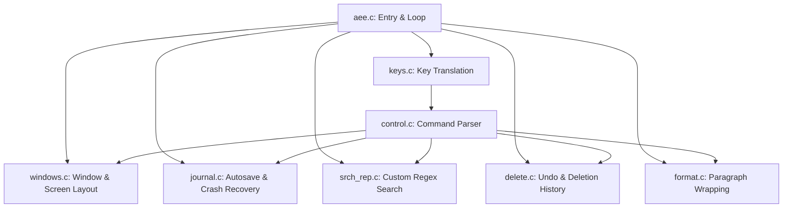

# AEE Submodule: Reverse Engineering Analysis

This document provides a comprehensive reverse engineering analysis of the C source code in the **AEE** (Another Easy Editor) submodule. 

Developed by Hugh Mahon starting in 1985, AEE is a lightweight, screen-oriented terminal text editor designed to be simple and require no user training. The analysis below details the software's architecture, data structures, and core subsystems.

---

## 1. System Architecture Overview

AEE follows a traditional event-driven single-threaded loop pattern common to early console text editors. It utilizes a modular structure, dividing its subsystems into dedicated C translation units:



### Main Execution Loop
At startup, `main()` in [aee.c](file:///home/lucy/Projects/git/ago/aee/aee.c#L521-L735) performs system initializations:
1. Installs signal handlers (disables most standard signals, registers custom cleanup `abort_edit` for `SIGINT`).
2. Allocates and initializes default buffers, structures, command-line targets, and key assignments.
3. Sets up curses/terminal properties via `set_up_term()`.
4. Enters a loop requesting key inputs using `wgetch()` inside `get_input()` and routes them via `keyboard()` to either character insertion or command parsing.

---

## 2. Core Data Structures

AEE is architected around two primary structures defined in [aee.h](file:///home/lucy/Projects/git/ago/aee/aee.h):

### Double-Linked List of Lines: `struct text`
AEE does not use a single flat character buffer or gap buffer. Instead, it represents the document as a double-linked list of individual lines:
```c
struct text {
    char *line;                     /* Pointer to null-terminated char string */
    int line_number;                /* 1-indexed line number */
    int line_length;                /* Current character count (including NULL) */
    int max_length;                 /* Current allocated capacity of the string */
    int vert_len;                   /* Number of screen rows occupied (due to wrapping) */
    struct text *next_line;         /* Pointer to next line */
    struct text *prev_line;         /* Pointer to previous line */
    struct ae_file_info file_info;  /* Disk location metadata for journaling */
    char changed;                   /* Flag indicating the line has been modified */
};
```
*Defined in [aee.h: L117-128](file:///home/lucy/Projects/git/ago/aee/aee.h#L117-L128).*

### Edit Buffer Tracking: `struct bufr`
AEE supports editing multiple files concurrently, tracking each file as a "buffer" containing its own text list, cursor state, terminal windows, and recovery journal:
```c
struct bufr {
    char *name;              /* Name of the buffer */
    struct text *first_line; /* Pointer to first line */
    struct text *curr_line;  /* Pointer to current line under the cursor */
    int scr_vert;            /* Last vertical cursor offset in window */
    int scr_horz;            /* Last horizontal cursor offset in window */
    int scr_pos;             /* Horizontal character offset from start of line */
    int position;            /* Target column position in current line */
    int abs_pos;             /* Desired horizontal target column when moving vertically */
    WINDOW *win;             /* Curses editing window */
    WINDOW *footer;          /* Curses footer window showing buffer name/status */
    int lines;               /* Height of the editing window */
    int last_line;           /* Bottom visible window line index */
    int last_col;            /* Rightmost visible column index */
    int num_of_lines;        /* Total number of lines in text list */
    int absolute_lin;        /* Absolute line number of current cursor position */
    int window_top;          /* Screen offset for top of window */
    int journ_fd;            /* File descriptor for crash recovery journal */
    char journalling;        /* True if journaling is active */
    char *journal_file;      /* Filename of the journal file */
    char *file_name;         /* Base name of the file */
    char *full_name;         /* Canonical absolute path of the file */
    char changed;            /* True if buffer has unsaved changes */
    char dos_file;           /* True if line endings are CRLF */
    struct stat fileinfo;    /* File statistics from stat() */
    ...
};
```
*Defined in [aee.h: L148-181](file:///home/lucy/Projects/git/ago/aee/aee.h#L148-L181).*

---

## 3. Core Subsystem Deep-Dive

### A. Journaling & Crash Recovery (`journal.c`)
To protect against program crashes, power failures, or hung connections, AEE implements a transaction-like journaling system in [journal.c](file:///home/lucy/Projects/git/ago/aee/journal.c).

1. **Active Session Database**: 
   AEE tracks all open files and their associated journal files in `~/.aeeinfo`. Access is guarded by a lockfile `~/.aeeinfo.L` to prevent edit conflicts and race conditions.
2. **On-Disk Double-Linked List representation**:
   Every line modified is appended to the journal file (`.rv` extension) at the end of the file. However, AEE mimics the memory representation on disk using file offsets to maintain structure. The `file_info` block of each line is written as:
   * File offset of previous line's metadata (`prev_info`)
   * File offset of next line's metadata (`next_info`)
   * File offset of the actual text (`line_location`)
   * Length of the line (`line_length`)
3. **Transaction Commit**: 
   When the cursor moves away from a line, the editor checks `line->changed`. If `TRUE`, it commits the line to disk via [write_journal](file:///home/lucy/Projects/git/ago/aee/journal.c#L82-L102), rewriting the line's metadata offset blocks to maintain the proper list ordering on disk.
4. **Disaster Recovery**:
   When AEE starts, it parses `~/.aeeinfo`. If it finds unfinished sessions, it allows the user to restore the document via [recover_from_journal](file:///home/lucy/Projects/git/ago/aee/journal.c#L296-L413). This reads the linked nodes sequentially from the disk journal offsets, recreating the document structure.

### B. Custom Parser & Regular Expression Engine (`srch_rep.c`)
AEE implements a custom search engine from scratch in [srch_rep.c](file:///home/lucy/Projects/git/ago/aee/srch_rep.c).

* **Regex Features Supported**:
  Rather than calling standard libraries (`<regex.h>`), [search](file:///home/lucy/Projects/git/ago/aee/srch_rep.c#L16-L369) handles wildcards manually:
  * `^` matches start of line
  * `$` matches end of line
  * `.` matches any single character
  * `*` matches zero or more occurrences (implemented recursively)
  * `[...]` matches character sets, supporting ranges (e.g. `[a-z]`), negations (e.g. `[^0-9]`), and escapes (`\\`).
* **Brace Matching**:
  The function [match](file:///home/lucy/Projects/git/ago/aee/srch_rep.c#L644-L749) parses the document to locate the corresponding closing or opening brace (`()`, `[]`, `{}`, `<>`). It checks the character under the cursor, sets the search direction, and utilizes `search()` with regex patterns (e.g. `[{}]`) while tracking nesting depth inside a counter to bypass inner blocks.

### C. Deletion & Undo Ring Buffer (`delete.c`)
AEE supports a multi-level undo stack (up to 128 levels) implemented as a circular linked list of structures:

```c
struct del_buffs {
    int flag;             /* Type of deletion: CHAR_DELETED, WORD_DELETED, LINE_DELETED, etc. */
    char character;       /* Store char if single-char deletion */
    char *string;         /* Store allocated string if word/line deletion */
    int length;           /* Length of deleted text */
    struct del_buffs *prev;
    struct del_buffs *next;
};
```
*Defined in [aee.h: L194-201](file:///home/lucy/Projects/git/ago/aee/aee.h#L194-L201).*

* **Ring Initialization**:
  [undel_init](file:///home/lucy/Projects/git/ago/aee/delete.c#L489-L513) allocates 128 `struct del_buffs` records and links them into a continuous loop. `undel_current` tracks the head pointer.
* **Recording Deletions**:
  Any deletion operation (e.g., `del_char`, `del_word`, `Clear_line`, or `delete` when backspacing) pushes the deleted fragment onto `undel_current` via [last_deleted](file:///home/lucy/Projects/git/ago/aee/delete.c#L375-L417), freeing the oldest item in the ring if it overflows.
* **Restoring State**:
  Calling [undel_last](file:///home/lucy/Projects/git/ago/aee/delete.c#L419-L464) reads the transaction at `undel_current`, inserts the text back at the cursor position, and moves the pointer backward.

### D. Paragraph Formatting & Auto-Wrap (`format.c`)
AEE features advanced margin controls, paragraph wrapping, and right-justified text generation:

* **Paragraph Reflow ([Format](file:///home/lucy/Projects/git/ago/aee/format.c#L47-L360))**:
  When formatting a paragraph, the editor traverses lines backwards and forwards until it hits blank lines to find paragraph boundaries. It then concatenates all lines in the paragraph into a single long temporary line, strips out double spaces (retaining two spaces after a period `.`), wraps words to fit between `left_margin` and `right_margin`, and splits them back into separate `struct text` lines.
* **Justification**:
  If `right_justify` is enabled, AEE calculates the padding needed at the end of each wrapped line and distributes spaces evenly between the words starting from the right.
* **Auto Wrap ([Auto_Format](file:///home/lucy/Projects/git/ago/aee/format.c#L400-L677))**:
  Runs interactively during typing. When a word crosses `right_margin`, it splits the word automatically, moves it to the next line, and joins words from the next line if space permits.

### E. Multiple-Window Management (`windows.c`)
AEE allows horizontal screen splits to display multiple open buffers simultaneously.

* **Window Redrawing ([redo_win](file:///home/lucy/Projects/git/ago/aee/windows.c#L265-L468))**:
  When a buffer is opened or deleted, AEE divides the available terminal height (excluding the help screen `info_win` and the prompt line `com_win`) equally among active buffers. It releases existing curses windows and spawns new subwindows (`win` and `footer`) for each.
* **Responsive Layouts**:
  `resize_check()` hooks terminal size changes. When the window is resized, it flags `window_resize = TRUE`, calls `redo_win()`, recomputes line wrap metrics for all texts, and redraws all contents.

---

## 4. Key Performance Characteristics & Constraints

1. **Virtual Memory Dependency**:
   AEE holds all open buffers in system RAM as double-linked lists. It has no page-swapping mechanisms for very large files, relying entirely on the operating system's virtual memory management.
2. **Double-Linked List Overhead**:
   Since every line is a separately allocated heap block (`malloc`), large documents generate a high volume of small allocations. This makes sequential traversals and search-replace operations CPU-bound by memory latency.
3. **Optimized Screen Redrawing**:
   Instead of refreshing the entire screen for small edits, AEE utilizes curses' `wdeleteln()` and `winsertln()` to scroll lines dynamically, minimizing terminal output bandwidth.

---

## 5. UI Observations: Information Window (`info_win`)

The Information Window (represented by `info_win` in the C sources) acts as an on-screen keyboard shortcut reference for users:
* **Dimensions**: It contains a maximum of 4 rows of text.
* **Keyboard Shortcuts**: Displays command shortcuts, keeping the `Esc` key represented as its literal named label.
* **Control/Alt Keys**: Lists `Ctrl` and `Alt` modifiers by their terminal ASCII code representations (e.g. `^` represents the Control key, as in `^ = Ctrl key`).
* **Highlighted Separator**: Includes a single line of highlighted separator that contains:
  * The "key compass" (the direction and navigation guide).
  * The instructional text: `"access HELP through menu"`.

---

## 6. UI Observations: Menu System

The menu system in AEE provides an interactive interface for accessing editor functions:
* **Visual Layout**: Menus are displayed as listed in the `menus` file, using ASCII-based boxes to group commands.
* **Border Highlighting**: The vertical `|` borders and the horizontal separators (constructed from `+` and `-` characters) are rendered with highlighting to distinguish the menu area from the text editor background.
* **Structure**: Each menu follows a consistent pattern:
    * A centered title at the top.
    * A list of options indexed by letters (e.g., `a) leave editor`).
    * Navigation hints at the bottom (e.g., `press Esc to cancel`).
